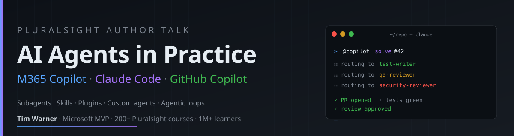

<p align="center">
  
</p>

<p align="center">
  <a href="https://techtrainertim.com"></a>
  <a href="https://app.pluralsight.com/profile/author/tim-warner"></a>
  <a href="https://mvp.microsoft.com/en-US/MVP/profile/tim-warner"></a>
  <a href="https://www.youtube.com/@TechTrainerTim"></a>
  <a href="https://www.linkedin.com/in/timothywarner/"></a>
</p>

<p align="center">
  <a href="./LICENSE"></a>
  <a href="../../actions/workflows/playwright.yml"></a>
  <a href="../../actions/workflows/codeql.yml"></a>
  <a href="../../security"></a>
  <a href="../../issues"></a>
  <a href="../../pulls"></a>
  <a href="../../commits/main"></a>
</p>

---

# Pluralsight Author Talk — AI Agents Demo

The companion repository for Tim Warner's Pluralsight Author Talk on **M365 Copilot, Claude Code, and GitHub Copilot**. Fork it, clone it, install it, watch the agents work.

This repo is the **shared demo surface** for the three beats of the talk:

| Beat | Tool | What you'll see |
|---|---|---|
| 1 — The Agent Ladder | M365 Copilot Chat → Copilot Studio → (Foundry mention) | Custom-instruction agent grounded in SharePoint, declarative agent built live in 90 seconds, one-line name-drop of Foundry. |
| 2 — The Headliner | Claude Code | Subagent orchestration generating Playwright specs against this app, with context discipline. |
| 3 — The Fleet | GitHub Copilot Coding Agent + PR Reviewer | One `AGENTS.md` (here: `.github/copilot-instructions.md`) governs every PR Copilot opens or reviews. |

---

## Repo layout

```
.
├── app/                          # The static demo web app
│   ├── public/
│   │   ├── index.html            # Browse learning paths
│   │   ├── enroll.html           # Enrollment form
│   │   ├── confirm.html          # Confirmation page
│   │   ├── scripts/              # Vanilla JS, no build step
│   │   └── styles/main.css
│   ├── package.json              # `npm run dev`, `npm test`
│   └── playwright.config.js
├── tests/                        # Subagents write Playwright specs here
├── .github/
│   ├── copilot-instructions.md   # The team quality bar — Beat 3's hero file
│   └── ISSUE_TEMPLATE/
├── .claude/
│   ├── agents/                   # test-writer, qa-reviewer, security-reviewer
│   └── skills/                   # playwright-spec-generator
└── prompts/                      # Copy-paste prompts for each tool
    ├── 01-m365-copilot-agent.md
    ├── 02-copilot-studio-agent.md
    └── 03-claude-code-subagents-and-skills.md
```

---

## Quick start

```bash
git clone https://github.com/timothywarner-org/pluralsight-author-talk-ai-agents.git
cd pluralsight-author-talk-ai-agents/app
npm install
npm run dev          # serves http://localhost:3000
npm test             # runs Playwright specs (after `npm run test:install`)
```

The app has no backend. Enrollment data lives in `sessionStorage`. Nothing leaves the browser.

---

## Following along

- **Want the prompts to recreate every demo?** → [`prompts/`](./prompts/)
- **Want the subagent definitions?** → [`.claude/agents/`](./.claude/agents/)
- **Want the Skill that drives the Playwright loop?** → [`.claude/skills/playwright-spec-generator/`](./.claude/skills/playwright-spec-generator/) (includes executable helpers under `scripts/` and reference docs under `reference/`)
- **Want the quality bar that drives Copilot Coding Agent and PR Reviewer?** → [`.github/copilot-instructions.md`](./.github/copilot-instructions.md)
- **Want issues you can assign to `@copilot` to watch it work?** → check the [open issues](../../issues) tagged `copilot-ready`.

## Security & supply chain

This repo runs the trio of GitHub-native quality gates side-by-side. It's a live reference for what "table stakes" looks like on a 2026 repo:

| Control | Where it lives | What it does |
|---|---|---|
| **CodeQL code scanning** | [`.github/workflows/codeql.yml`](./.github/workflows/codeql.yml) | JS + Actions static analysis on push, PR, and weekly. `security-extended` query suite. |
| **Playwright CI** | [`.github/workflows/playwright.yml`](./.github/workflows/playwright.yml) | Runs every spec on push and PR. Uploads HTML reports as artifacts. |
| **Dependabot** | [`.github/dependabot.yml`](./.github/dependabot.yml) | Weekly grouped PRs for npm + GitHub Actions updates. |
| **Secret scanning** | Repo setting | GitHub-native credential detection. Enabled. |
| **Push protection** | Repo setting | Blocks pushes that contain detected secrets. Enabled. |
| **Security policy** | [`SECURITY.md`](./SECURITY.md) | How to report a real vulnerability. |

---

## About

Tim Warner is a Principal Staff Author at Pluralsight, a Microsoft MVP for Azure AI, and a 28-year enterprise technology instructor. He has built 200+ Pluralsight courses watched by over a million learners. Find him at [TechTrainerTim.com](https://techtrainertim.com) or on [Pluralsight](https://app.pluralsight.com/profile/author/tim-warner).

## License

MIT — see [LICENSE](./LICENSE).
